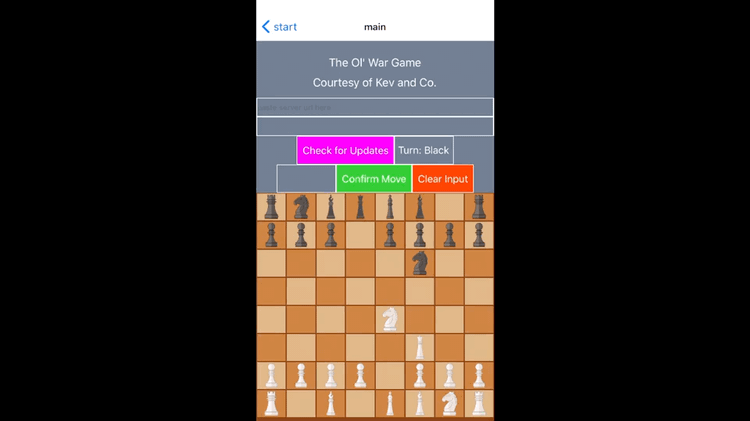

# ChessGUI

## Demonstration of GUI

- Making a move:

- Attempting to make an invalid move because a piece is obstructed by another piece:

## Setting up development environment

With npm installed, from the root of this repo after cloning, run the following command:

`$ npm install`

This will install all of the necessary dependencies that are not being tracked by git.

Then use the following command to start the expo environment:

`$ npm start`